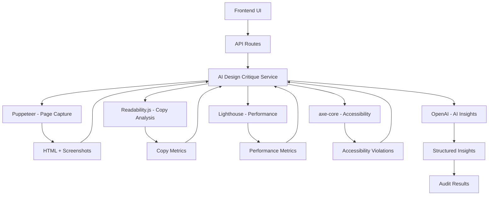

# AI Design Critique System

## 🎯 Overview

The AI Design Critique system is a comprehensive automated analysis tool that provides intelligent feedback on web applications. It combines multiple analysis techniques to deliver actionable insights for improving user experience, performance, accessibility, and content quality.

## ✨ Features

### **Multi-Modal Analysis**
- **Copy Analysis**: Content readability, clarity, and impact assessment
- **Performance Analysis**: Core Web Vitals and page load optimization
- **Accessibility Analysis**: WCAG compliance and accessibility violations
- **UX Analysis**: User experience friction points and improvement suggestions

### **AI-Powered Insights**
- **Structured Feedback**: Organized by severity and priority
- **Actionable Suggestions**: Specific implementation guidance
- **Impact Assessment**: Estimated benefits of suggested improvements
- **Plain English Explanations**: Easy-to-understand recommendations

### **Real-Time Analysis**
- **Live Preview Analysis**: Analyze deployed applications instantly
- **Comprehensive Reports**: Detailed breakdown of findings
- **Visual Scorecards**: Easy-to-understand metrics and scores
- **Export Capabilities**: Share and save analysis results

## 🏗️ Architecture

### **Core Components**



### **Technology Stack**

#### **Backend Services**
- **Puppeteer**: Headless browser for page capture and analysis
- **Readability.js**: Content extraction and readability scoring
- **Lighthouse**: Performance and accessibility metrics
- **axe-core**: WCAG compliance testing
- **OpenAI GPT-4**: AI-powered insights generation

#### **Frontend Components**
- **React/Next.js**: Modern UI framework
- **TypeScript**: Type-safe development
- **Tailwind CSS**: Utility-first styling
- **Shadcn/ui**: Component library
- **Lucide React**: Icon library

## 🚀 Quick Start

### **1. Installation**

```bash
# Install dependencies
npm install

# Add required environment variables
cp env.example .env.local
```

### **2. Environment Setup**

```env
# OpenAI Configuration
OPENAI_API_KEY=your_openai_api_key

# Optional: Alternative LLM providers
GROQ_API_KEY=your_groq_api_key
ANTHROPIC_API_KEY=your_anthropic_api_key
```

### **3. Running an Audit**

```typescript
// API Endpoint
POST /api/audit/analyze

// Request Body
{
  "url": "https://your-app.vercel.app",
  "projectId": "optional-project-id",
  "auditType": "full" // "full" | "performance" | "accessibility" | "copy"
}

// Response
{
  "success": true,
  "audit": {
    "headlineGrade": 7,
    "frictionPoints": [...],
    "performanceScore": 85,
    "accessibilityViolations": [...],
    "suggestions": [...],
    "copyAnalysis": {...},
    "performanceMetrics": {...},
    "accessibilityMetrics": {...}
  }
}
```

## 📊 Analysis Types

### **1. Full Audit**
Complete analysis covering all aspects:
- Copy quality and readability
- Performance metrics and Core Web Vitals
- Accessibility compliance
- UX friction points
- Comprehensive suggestions

### **2. Performance Analysis**
Focused on speed and optimization:
- First Contentful Paint (FCP)
- Largest Contentful Paint (LCP)
- Cumulative Layout Shift (CLS)
- First Input Delay (FID)
- Speed Index

### **3. Accessibility Analysis**
WCAG compliance testing:
- ARIA violations
- Color contrast issues
- Keyboard navigation
- Screen reader compatibility
- Semantic HTML structure

### **4. Copy Analysis**
Content quality assessment:
- Readability scores (Flesch Reading Ease)
- Clarity issues identification
- Improvement suggestions
- Content structure analysis

## 🎨 UI Components

### **AuditDashboard**
Main interface for running audits:
- Audit type selection
- URL input and validation
- Real-time progress tracking
- Results display

### **AuditResults**
Comprehensive results display:
- Overall score calculation
- Detailed metrics breakdown
- Friction points identification
- Actionable suggestions

### **ScoreCard**
Individual metric display:
- Visual progress indicators
- Color-coded severity levels
- Trend indicators
- Detailed descriptions

### **FrictionPointCard**
Issue identification display:
- Severity-based styling
- Location indicators
- Specific suggestions
- Category classification

### **SuggestionCard**
Actionable improvement display:
- Priority-based organization
- Implementation guidance
- Impact assessment
- Category-specific icons

## 🔧 Configuration

### **Lighthouse Configuration**

```typescript
const lighthouseConfig = {
  extends: 'lighthouse:default',
  settings: {
    onlyCategories: ['performance', 'accessibility'],
    formFactor: 'desktop',
    throttling: {
      rttMs: 40,
      throughputKbps: 10240,
      cpuSlowdownMultiplier: 1
    }
  }
};
```

### **OpenAI Prompt Engineering**

```typescript
const buildInsightPrompt = (signals: AuditSignals, auditType: AuditType) => {
  return `
    Analyze this web application and provide design insights for a ${auditType} audit.
    
    Copy Analysis: ${JSON.stringify(signals.copyAnalysis)}
    Performance Metrics: ${JSON.stringify(signals.performanceMetrics)}
    Accessibility Violations: ${JSON.stringify(signals.accessibilityViolations)}
    
    Provide structured feedback as JSON with:
    - headlineGrade (1-10)
    - frictionPoints (array)
    - suggestions (array)
  `;
};
```

## 📈 Metrics & Scoring

### **Overall Score Calculation**
```typescript
const getOverallScore = (audit: DesignAudit, auditType: AuditType) => {
  const scores = [];
  
  if (auditType === 'full' || auditType === 'copy') {
    scores.push(audit.headlineGrade * 10);
  }
  
  if (auditType === 'full' || auditType === 'performance') {
    scores.push(audit.performanceScore);
  }
  
  if (auditType === 'full' || auditType === 'accessibility') {
    scores.push(100 - (audit.accessibilityViolations.length * 10));
  }
  
  return Math.round(scores.reduce((a, b) => a + b, 0) / scores.length);
};
```

### **Performance Scoring**
```typescript
const calculatePerformanceScore = (metrics: PerformanceMetrics) => {
  const fcpScore = Math.max(0, 100 - (metrics.firstContentfulPaint / 10));
  const lcpScore = Math.max(0, 100 - (metrics.largestContentfulPaint / 100));
  const clsScore = Math.max(0, 100 - (metrics.cumulativeLayoutShift * 1000));
  const fidScore = Math.max(0, 100 - (metrics.firstInputDelay / 10));
  
  return Math.round((fcpScore + lcpScore + clsScore + fidScore) / 4);
};
```

## 🧪 Testing

### **Unit Tests**
```bash
# Run unit tests
npm run test:unit

# Test specific components
npm test -- --testPathPattern=audit
```

### **Integration Tests**
```bash
# Run integration tests
npm run test:integration

# Test API endpoints
npm test -- --testPathPattern=api/audit
```

### **E2E Tests**
```bash
# Run end-to-end tests
npm run test:e2e

# Test audit workflow
npx playwright test audit-workflow.spec.ts
```

## 🚀 Deployment

### **Vercel Deployment**
```bash
# Deploy to Vercel
vercel --prod

# Configure environment variables
vercel env add OPENAI_API_KEY
```

### **Docker Deployment**
```dockerfile
FROM node:18-alpine

WORKDIR /app
COPY package*.json ./
RUN npm ci --only=production

COPY . .
RUN npm run build

EXPOSE 3000
CMD ["npm", "start"]
```

## 📝 API Reference

### **POST /api/audit/analyze**
Analyze a web application URL.

**Request:**
```typescript
{
  url: string;
  projectId?: string;
  auditType?: 'full' | 'performance' | 'accessibility' | 'copy';
}
```

**Response:**
```typescript
{
  success: boolean;
  audit: DesignAudit;
  timestamp: string;
}
```

### **GET /api/audit/history**
Get audit history for a project.

**Query Parameters:**
- `projectId`: string (required)
- `limit`: number (default: 10)
- `offset`: number (default: 0)

**Response:**
```typescript
{
  success: boolean;
  audits: AuditHistory[];
  total: number;
  page: number;
  limit: number;
  hasMore: boolean;
}
```

## 🔒 Security & Rate Limiting

### **Rate Limiting**
- 10 requests per minute per user
- Configurable limits per audit type
- IP-based rate limiting

### **Security Measures**
- Input validation and sanitization
- CORS configuration
- Authentication required for project-specific audits
- Secure environment variable handling

## 🎯 Best Practices

### **For Developers**
1. **Run audits regularly** during development
2. **Focus on critical issues** first
3. **Use specific audit types** for targeted improvements
4. **Monitor performance trends** over time
5. **Integrate with CI/CD** for automated testing

### **For Product Managers**
1. **Review audit results** before user testing
2. **Prioritize high-impact suggestions**
3. **Track improvement metrics** over time
4. **Use insights for roadmap planning**
5. **Share results with stakeholders**

## 🤝 Contributing

### **Adding New Analysis Types**
1. Extend the `AuditType` enum
2. Add signal extraction logic
3. Update the insight prompt
4. Create UI components
5. Add tests

### **Improving AI Insights**
1. Enhance prompt engineering
2. Add more context to analysis
3. Implement feedback loops
4. Optimize response parsing
5. Add custom scoring algorithms

## 📚 Resources

- [Lighthouse Documentation](https://developers.google.com/web/tools/lighthouse)
- [axe-core Documentation](https://github.com/dequelabs/axe-core)
- [Readability.js Documentation](https://github.com/mozilla/readability)
- [WCAG Guidelines](https://www.w3.org/WAI/WCAG21/quickref/)
- [Core Web Vitals](https://web.dev/vitals/)

## 🆘 Troubleshooting

### **Common Issues**

**Puppeteer Timeout**
```bash
# Increase timeout in service configuration
const browser = await puppeteer.launch({
  args: ['--no-sandbox', '--disable-setuid-sandbox', '--timeout=60000']
});
```

**Lighthouse Errors**
```bash
# Ensure Chrome is available
# For Docker deployments, install Chrome dependencies
RUN apt-get update && apt-get install -y \
    chromium-browser \
    fonts-ipafont-gothic \
    fonts-wqy-zenhei \
    fonts-thai-tlwg \
    fonts-kacst \
    fonts-freefont-ttf
```

**OpenAI Rate Limits**
```bash
# Implement exponential backoff
# Use alternative providers (Groq, Anthropic)
# Cache results for repeated audits
```

## 📄 License

This project is licensed under the MIT License - see the [LICENSE](LICENSE) file for details. 