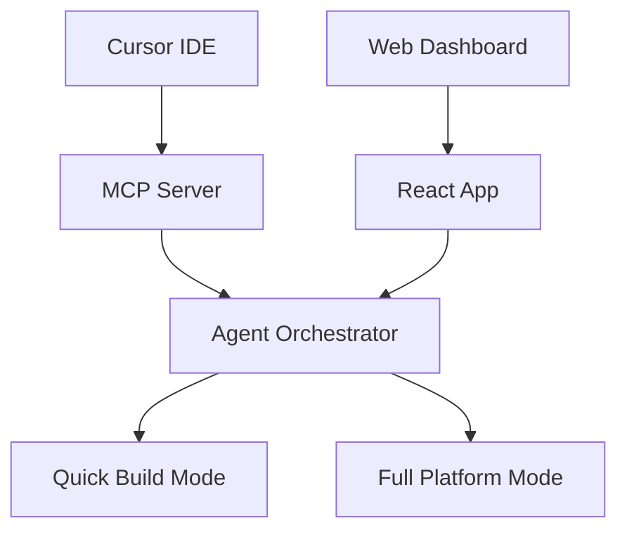
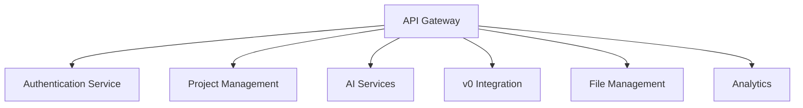
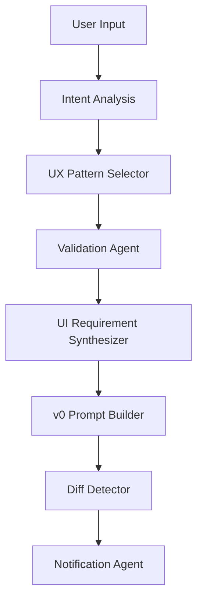
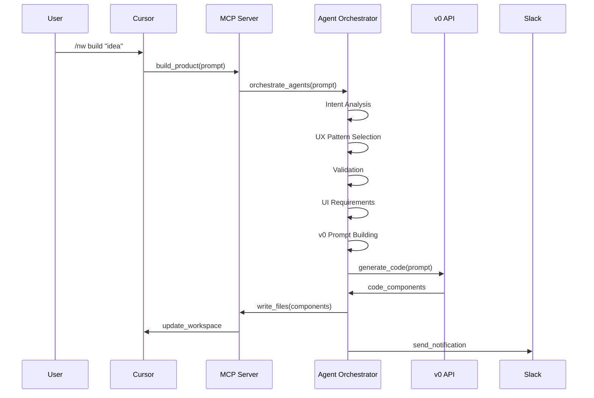
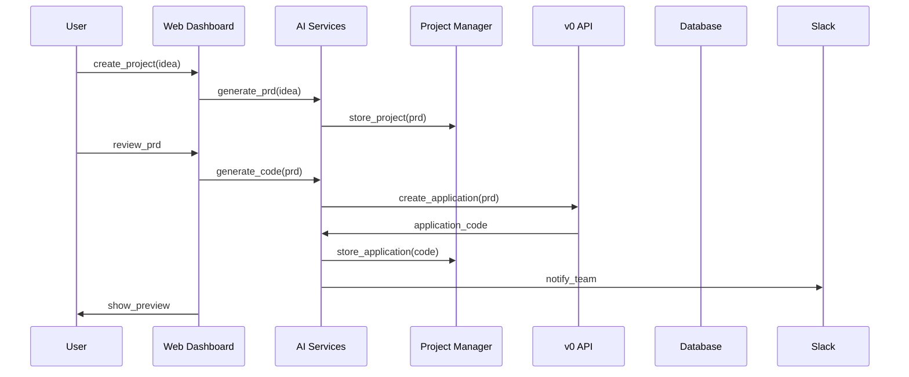

# CursorFlow - Hybrid Architecture

## 🏗️ **System Architecture Overview**

CursorFlow implements a dual-mode architecture that seamlessly combines the speed of Nuggetwise Builder with the comprehensive capabilities of a full PRD-to-Code platform.

---

## **🎯 Core Architecture Principles**

### **1. Dual-Mode Design**
- **Quick Build Mode**: Single command interface for rapid prototyping
- **Full Platform Mode**: Comprehensive workflow for enterprise development
- **Seamless Transition**: Users can upgrade from Quick Build to Full Platform

### **2. Agent-First Approach**
- **7-Agent Orchestration**: Specialized AI agents for different tasks
- **Transparent Reasoning**: All AI decisions are explainable
- **Modular Design**: Agents can be used independently or together

### **3. Cloud-Native Architecture**
- **Serverless Functions**: Scalable, cost-effective deployment
- **Real-time Collaboration**: Live updates and notifications
- **Zero Local Setup**: Everything works in the browser/cloud

---

## **🏛️ System Components**

### **Frontend Layer**


### **Backend Services**


### **AI Agent Layer**


---

## **🔧 Technical Stack**

### **Frontend Technologies**
- **Cursor IDE**: Primary development environment
- **React/Next.js**: Web dashboard and components
- **TypeScript**: Type-safe development
- **Tailwind CSS**: Utility-first styling
- **MCP Protocol**: Cursor integration

### **Backend Technologies**
- **Node.js/Express**: API server
- **Firebase/Firestore**: Database and authentication
- **OpenAI API**: AI model integration
- **v0 Platform API**: Code generation
- **Slack API**: Notifications

### **Infrastructure**
- **Vercel**: Frontend and serverless functions
- **Supabase**: Database and real-time features
- **Cloudflare**: CDN and edge computing
- **GitHub**: Version control and CI/CD

---

## **🔄 Data Flow Architecture**

### **Quick Build Flow**


### **Full Platform Flow**


---

## **🔐 Security Architecture**

### **Authentication & Authorization**
- **JWT Tokens**: Secure API authentication
- **Role-Based Access**: Different permissions for different user types
- **API Key Management**: Secure storage and rotation
- **Rate Limiting**: Protection against abuse

### **Data Security**
- **Encryption at Rest**: All data encrypted in database
- **Encryption in Transit**: HTTPS for all communications
- **Input Validation**: Sanitize all user inputs
- **Audit Logging**: Track all system activities

---

## **📊 Monitoring & Analytics**

### **Performance Monitoring**
- **Response Time**: Track API response times
- **Error Rates**: Monitor system errors
- **Resource Usage**: CPU, memory, and storage
- **User Experience**: Page load times and interactions

### **Business Analytics**
- **User Engagement**: Feature usage and retention
- **Conversion Rates**: Quick Build to Full Platform
- **Cost Analysis**: API usage and costs
- **Quality Metrics**: Code quality and user satisfaction

---

## **🚀 Deployment Architecture**

### **Development Environment**
```bash
# Local Development
npm run dev:all          # Start all services locally
npm run dev:frontend     # Frontend only
npm run dev:backend      # Backend only
npm run dev:mcp          # MCP server only
```

### **Production Environment**
```bash
# Production Deployment
npm run build:all        # Build all packages
npm run deploy:vercel    # Deploy to Vercel
npm run deploy:functions # Deploy serverless functions
```

### **Environment Configuration**
- **Development**: Local services with mock data
- **Staging**: Production-like environment for testing
- **Production**: Live environment with real data
- **Testing**: Isolated environment for automated tests

---

## **🔄 Integration Points**

### **v0 Platform Integration**
Based on [v0.dev Cursor documentation](https://v0.dev/docs/cursor):
- **API Endpoint**: `https://api.v0.dev/v1`
- **Model**: `v0-1.0-md`
- **Authentication**: API key in headers
- **Response Format**: JSON with component data

### **Cursor IDE Integration**
- **MCP Protocol**: Model Context Protocol for tool integration
- **Slash Commands**: `/nw build`, `/nw update`, `/nw pull`
- **File System Access**: Direct workspace manipulation
- **Real-time Updates**: Live preview and notifications

### **Slack Integration**
- **Incoming Webhooks**: Real-time notifications
- **Event Types**: Build completion, errors, cost alerts
- **Message Format**: Rich text with links and attachments
- **Channel Management**: Team-specific notifications

---

## **📈 Scalability Considerations**

### **Horizontal Scaling**
- **Load Balancing**: Distribute requests across multiple instances
- **Auto-scaling**: Automatically scale based on demand
- **Database Sharding**: Distribute data across multiple databases
- **CDN**: Cache static assets globally

### **Performance Optimization**
- **Caching**: Redis for frequently accessed data
- **Database Indexing**: Optimize query performance
- **Code Splitting**: Load only necessary code
- **Image Optimization**: Compress and optimize images

---

## **🔧 Configuration Management**

### **Environment Variables**
```bash
# Core Configuration
NODE_ENV=production
PORT=3000
API_BASE_URL=https://api.cursorflow.com

# AI Services
OPENAI_API_KEY=sk-...
V0_API_KEY=v0_...
ANTHROPIC_API_KEY=sk-ant-...

# Database
SUPABASE_URL=https://...
SUPABASE_ANON_KEY=...
SUPABASE_SERVICE_ROLE_KEY=...

# External Services
SLACK_WEBHOOK_URL=https://...
STRIPE_SECRET_KEY=sk_...
SENTRY_DSN=https://...

# Security
JWT_SECRET=...
ENCRYPTION_KEY=...
```

### **Feature Flags**
```typescript
interface FeatureFlags {
  enableQuickBuild: boolean;
  enableFullPlatform: boolean;
  enableSlackNotifications: boolean;
  enableAnalytics: boolean;
  enableEnterpriseFeatures: boolean;
}
```

---

*This architecture provides a solid foundation for both rapid prototyping and enterprise-grade development, with seamless transitions between modes.* 