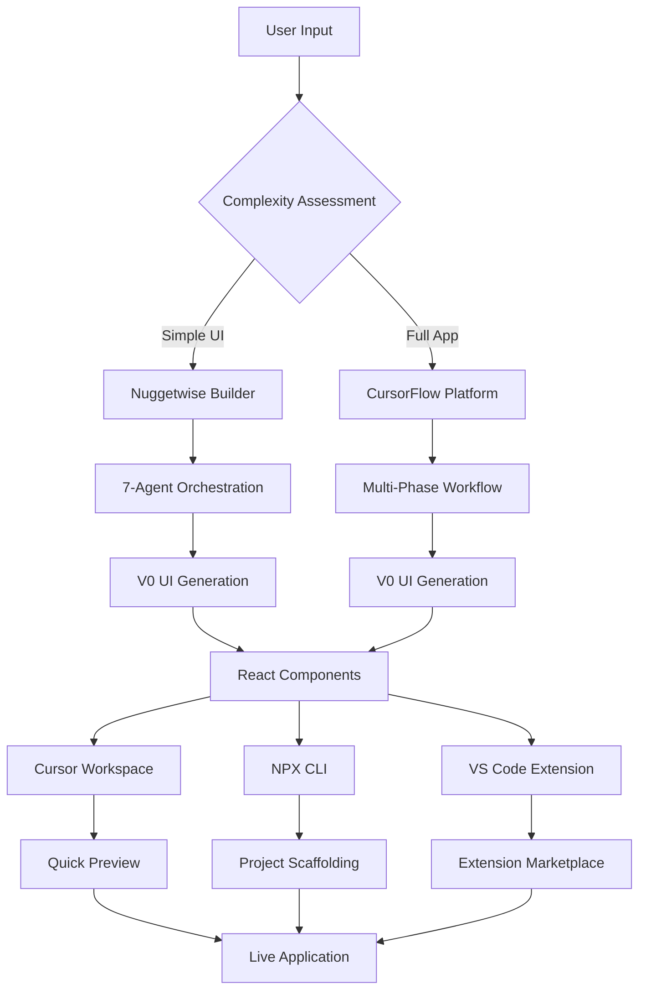

# CursorFlow - Hybrid PRD-to-Code Platform

## 🎯 **Executive Summary**

**CursorFlow** is a unified platform that provides **MCP (Model Context Protocol) integration as the primary approach** for seamless Cursor IDE integration, enhanced with V0 AI-powered UI generation. The platform offers:

- **MCP Integration (Primary)**: Seamless Cursor IDE integration with intelligent AI responses and context-aware generation
- **CLI Option (Secondary)**: Command-line interface for power users who prefer automation and scripting
- **Multi-Platform Support**: MCP works across Cursor IDE, NPX CLI, and VS Code extension for consistent experience

### **Core Value Proposition**
- **For Non-Technical Users**: Natural language prompts → intelligent MCP responses with V0 UI generation
- **For Product Managers**: Seamless MCP integration for comprehensive PRD generation and full-stack development
- **For Teams**: Native Cursor IDE collaboration with transparent AI reasoning and MCP integration
- **For Organizations**: 80% reduction in time-to-market with MCP-first enterprise features and multi-platform support

## 📁 **Documentation Organization**

This implementation plan is organized into two main folders for different stakeholders:

### **👨‍💻 [Developer Implementation](./dev-implementation/)**
Technical documentation for developers and engineering teams:
- API Specifications & Backend Architecture
- MCP-First System Architecture (includes comprehensive overview)
- V0 Integration Implementation Plan
- Nuggetwise Builder Technical Implementation
- Integration Guide & MCP Alignment
- Testing Strategies & Deployment Guides
- Environment Setup & Configuration

### **💼 [Business & Product](./business-product/)**
Business strategy and product documentation for product managers and business teams:
- Product Requirements Document (PRD)
- Business Model & Pricing Strategy
- Platform Overview & Feature Specifications
- User Experience Analysis & Market Research
- Implementation Roadmap

## 🏗️ **Architecture Overview**

### **Enhanced System Architecture**

### **MCP Integration (Primary Mode)**
- **7-Agent System**: Intent-Analysis → UX-Pattern Selector → Validation → UI-Req Synthesizer → V0 Prompt-Builder → Diff-Detector → Notification
- **V0 Integration**: AI-powered UI generation with direct file writing
- **Native Cursor Integration**: Seamless Model Context Protocol integration
- **Intelligent Responses**: Context-aware AI responses with rich formatting
- **Multi-Platform Support**: Works across Cursor IDE, NPX CLI, and VS Code extension

### **CLI Option (Secondary Mode)**
- **Command-Line Interface**: For power users who prefer automation and scripting
- **V0 Integration**: AI-powered UI generation with command-line workflow
- **Backend Logic**: Full-stack application development
- **Design Critique**: AI-powered UX analysis and optimization
- **Enterprise Features**: Authentication, version control, compliance
- **Legacy Support**: Maintains compatibility with existing CLI workflows

## 🚀 **Quick Start Guide**

### **For Developers**
1. Start with [Environment Setup](./dev-implementation/ENVIRONMENT_SETUP.md)
2. Review [MCP-First Architecture](./dev-implementation/HYBRID_ARCHITECTURE.md) (includes comprehensive overview)
3. Implement using [API Specs](./dev-implementation/API_SPECS.md) and [Backend Specs](./dev-implementation/BACKEND_SPECS.md)
4. Follow [V0 Integration Plan](./dev-implementation/V0_INTEGRATION_ENHANCED_PLAN.md)
5. Use [Nuggetwise Builder](./dev-implementation/NUGGETWISE_BUILDER.md) for MCP implementation
6. Follow [Testing Strategy](./dev-implementation/TESTING.md)
7. Deploy using [Deployment Guide](./dev-implementation/DEPLOYMENT.md)

### **For Product Managers**
1. Review [Product Requirements](./business-product/CURSORFLOW_PRD.md)
2. Understand [Business Model](./business-product/BUSINESS_MODEL.md)
3. Plan with [Implementation Checklist](./business-product/HYBRID_IMPLEMENTATION_CHECKLIST.md)
4. Analyze [User Flows](./business-product/V0_USER_FLOW_COMPARISON.md)

## 🎯 **Success Metrics**

### **MCP Integration (Primary)**
- **Speed**: <15 seconds from natural language prompt to intelligent response
- **Success Rate**: >95% successful MCP interactions
- **User Satisfaction**: >4.5/5 rating for seamless Cursor IDE integration
- **Adoption Rate**: >80% of users prefer MCP over CLI

### **CLI Option (Secondary)**
- **Speed**: <30 seconds from command to working frontend
- **Success Rate**: >90% successful CLI generation
- **User Satisfaction**: >4.0/5 rating for power users
- **Usage Rate**: <20% of users prefer CLI for automation

## 🔗 **Quick Navigation**

### **Technical Documentation**
- [MCP-First Architecture](./dev-implementation/HYBRID_ARCHITECTURE.md) (includes comprehensive overview)
- [API Specifications](./dev-implementation/API_SPECS.md)
- [Backend Architecture](./dev-implementation/BACKEND_SPECS.md)
- [V0 Integration Plan](./dev-implementation/V0_INTEGRATION_ENHANCED_PLAN.md)
- [Nuggetwise Builder](./dev-implementation/NUGGETWISE_BUILDER.md)
- [Testing Strategy](./dev-implementation/TESTING.md)
- [Deployment Guide](./dev-implementation/DEPLOYMENT.md)

### **Business Documentation**
- [Product Requirements](./business-product/CURSORFLOW_PRD.md)
- [Business Model](./business-product/BUSINESS_MODEL.md)
- [Platform Overview](./business-product/CURSORFLOW_PLATFORM.md)
- [Implementation Roadmap](./business-product/HYBRID_IMPLEMENTATION_CHECKLIST.md)
- [User Experience Analysis](./business-product/V0_USER_FLOW_COMPARISON.md)

---

*Last updated: December 2024* 