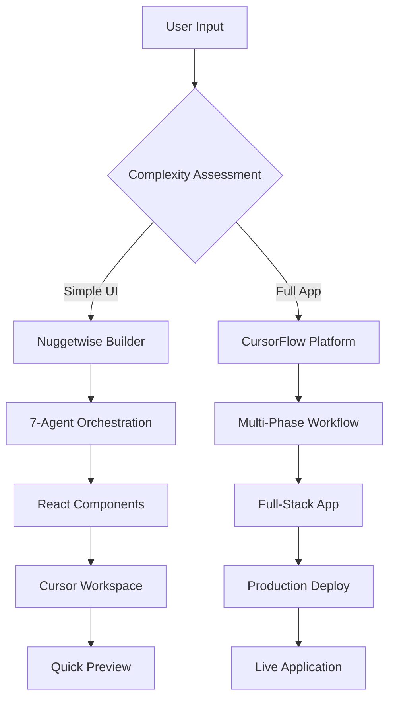

# CursorFlow - Hybrid PRD-to-Code Platform

## 🎯 **Executive Summary**

**CursorFlow** is a unified platform that combines the speed of Nuggetwise Builder's `/nw` commands with the comprehensive capabilities of a full PRD-to-Code platform. Users can choose between:

- **Quick Build Mode** (`/nw`): Generate React/Tailwind frontends in 30 seconds
- **Full Platform Mode**: Complete PRD-to-production workflow with backend integration

### **Core Value Proposition**
- **For Non-Technical Users**: Single `/nw build "idea"` command → working frontend
- **For Product Managers**: Comprehensive PRD generation and full-stack development
- **For Teams**: Seamless collaboration with transparent AI reasoning
- **For Organizations**: 80% reduction in time-to-market with enterprise features

## 🏗️ **Architecture Overview**

### **Dual-Mode System**


### **Nuggetwise Builder (Quick Mode)**
- **7-Agent System**: Intent-Analysis → UX-Pattern Selector → Validation → UI-Req Synthesizer → v0 Prompt-Builder → Diff-Detector → Notification
- **MCP Integration**: Model Context Protocol for Cursor integration
- **Slack Notifications**: Real-time updates and alerts
- **Budget Guards**: Cost and timeout protection

### **CursorFlow Platform (Full Mode)**
- **PRD Generation**: AI-powered requirements documentation
- **v0 Integration**: Direct PRD-to-code transformation
- **Backend Logic**: Full-stack application development
- **Design Critique**: AI-powered UX analysis and optimization
- **Enterprise Features**: Authentication, version control, compliance

## 🚀 **Implementation Phases**

### **Phase 1: Documentation & Planning (Week 1)**
- [ ] Update all documentation files
- [ ] Create new agent prompts
- [ ] Update environment configuration
- [ ] Set up development infrastructure

### **Phase 2: Nuggetwise Builder MVP (Weeks 2-3)**
- [ ] Implement 7-agent orchestration system
- [ ] Create MCP server with `/nw` commands
- [ ] Add Slack integration
- [ ] Implement budget and timeout guards

### **Phase 3: Platform Integration (Weeks 4-5)**
- [ ] Connect Nuggetwise to CursorFlow backend
- [ ] Add "Upgrade to Full App" functionality
- [ ] Implement unified authentication
- [ ] Create seamless mode switching

### **Phase 4: Enterprise Features (Week 6)**
- [ ] Add version control and collaboration
- [ ] Implement compliance and security features
- [ ] Create analytics and monitoring
- [ ] Launch beta program

## 🎯 **Success Metrics**

### **Quick Build Mode**
- **Speed**: <30 seconds from idea to working frontend
- **Success Rate**: >95% successful generation
- **User Satisfaction**: >4.5/5 rating

### **Full Platform Mode**
- **Time Reduction**: 80% faster than traditional development
- **Quality**: >90% of generated code passes review
- **Enterprise Adoption**: >50% of users upgrade from Quick Build

## 📚 **Documentation Structure**

```
implementation-plan/
├── README.md                    # This file - Overview
├── HYBRID_ARCHITECTURE.md       # Technical architecture
├── NUGGETWISE_BUILDER.md        # Quick build implementation
├── HYBRID_IMPLEMENTATION_CHECKLIST.md # Complete task breakdown
├── HYBRID_SUMMARY.md            # Executive summary
├── CURSORFLOW_PRD.md            # Product requirements
├── BUSINESS_MODEL.md            # Business strategy
├── API_SPECS.md                 # API documentation
├── DEPLOYMENT.md                # Deployment strategies
├── TESTING.md                   # Testing strategies
├── FRONTEND_SPECS.md            # Frontend specifications
├── BACKEND_SPECS.md             # Backend specifications
└── ENVIRONMENT_SETUP.md         # Environment configuration
```

## 🔗 **Quick Links**

- [Hybrid Architecture](./HYBRID_ARCHITECTURE.md)
- [Nuggetwise Builder](./NUGGETWISE_BUILDER.md)
- [Implementation Checklist](./HYBRID_IMPLEMENTATION_CHECKLIST.md)
- [Executive Summary](./HYBRID_SUMMARY.md)
- [Product Requirements](./CURSORFLOW_PRD.md)
- [Business Model](./BUSINESS_MODEL.md)
- [API Specifications](./API_SPECS.md)
- [Deployment Guide](./DEPLOYMENT.md)
- [Testing Strategy](./TESTING.md)
- [Frontend Specs](./FRONTEND_SPECS.md)
- [Backend Specs](./BACKEND_SPECS.md)
- [Environment Setup](./ENVIRONMENT_SETUP.md)

---

*Last updated: December 2024* 