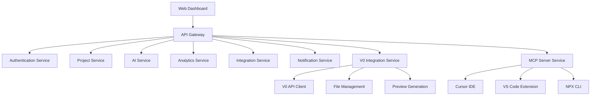
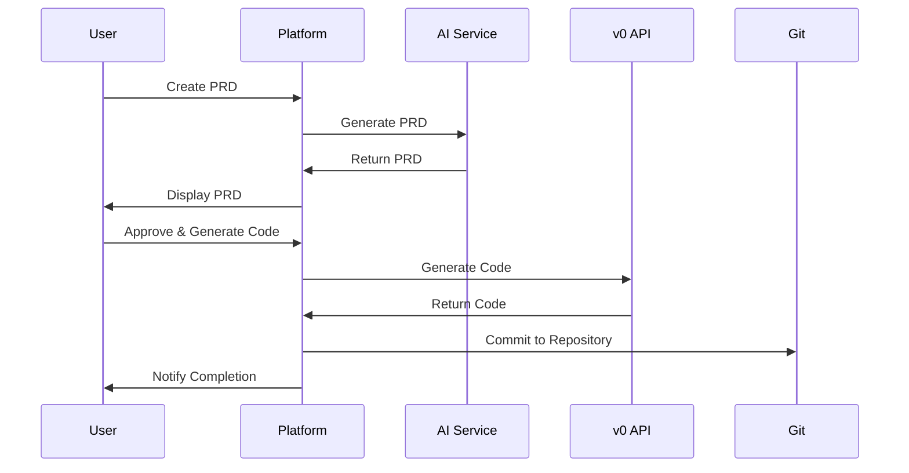
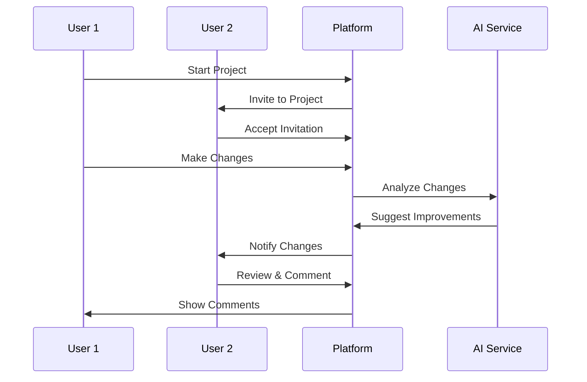

# CursorFlow Platform - Full Platform Implementation

## 🏢 **Platform Overview**

CursorFlow Platform is the comprehensive PRD-to-Code solution that extends beyond Quick Build mode, providing enterprise-grade features for teams, collaboration, and complex project management.

---

## **🎯 Platform Capabilities**

### **Core Platform Features**
- **PRD Generation**: AI-powered product requirement document creation
- **Code Generation**: Full-stack application development with V0 integration
- **V0 UI Generation**: Direct AI-powered UI component generation
- **Project Management**: Team collaboration and version control
- **Analytics & Insights**: Performance tracking and optimization
- **Enterprise Security**: Role-based access and compliance
- **Integration Hub**: Third-party service connections
- **Multi-Platform Support**: NPX CLI and VS Code extension

### **Advanced Workflow Management**
- **Multi-User Collaboration**: Real-time editing and commenting
- **Version Control**: Git integration with conflict resolution
- **Deployment Pipeline**: Automated testing and deployment
- **Code Review**: AI-assisted code quality assessment
- **Documentation**: Auto-generated technical documentation
- **V0 Integration**: Seamless UI generation and iteration
- **MCP Server**: Native Cursor IDE integration

---

## **🏗️ Platform Architecture**

### **Service Layer Architecture**


### **Database Schema**
```sql
-- Users and Teams
users (id, email, name, role, team_id)
teams (id, name, plan, settings)
team_members (team_id, user_id, role)

-- Projects
projects (id, name, description, team_id, status)
project_versions (id, project_id, version, changes)
project_files (id, project_id, path, content, type)

-- AI Interactions
ai_sessions (id, user_id, project_id, type, prompt, response)
ai_analytics (id, session_id, metrics, cost, duration)

-- Integrations
integrations (id, team_id, service, config, status)
webhooks (id, integration_id, event, url, secret)
```

---

## **🔧 Technical Implementation**

### **Backend Services**

#### **Authentication Service**
```typescript
// backend/services/auth.service.ts
export class AuthService {
  async authenticateUser(token: string): Promise<User> {
    // JWT validation and user retrieval
  }
  
  async createTeam(userId: string, teamData: TeamData): Promise<Team> {
    // Team creation with role assignment
  }
  
  async assignRole(teamId: string, userId: string, role: Role): Promise<void> {
    // Role-based access control
  }
}
```

#### **Project Management Service**
```typescript
// backend/services/project.service.ts
export class ProjectService {
  async createProject(teamId: string, projectData: ProjectData): Promise<Project> {
    // Project initialization with version control
  }
  
  async updateProject(projectId: string, updates: ProjectUpdates): Promise<Project> {
    // Version-controlled project updates
  }
  
  async getProjectHistory(projectId: string): Promise<ProjectVersion[]> {
    // Complete project version history
  }
}
```

#### **V0 Integration Service**
```typescript
// backend/services/v0-integration.service.ts
export class V0IntegrationService {
  private v0Client: V0Client;
  private fileManager: FileManager;

  constructor() {
    this.v0Client = new V0Client(process.env.V0_API_KEY);
    this.fileManager = new FileManager();
  }

  async generateUI(prompt: string, targetDir: string, context?: any): Promise<V0GenerationResult> {
    // Generate UI components using V0 API
    const result = await this.v0Client.generate(prompt, context);
    
    // Write files to target directory
    await this.fileManager.writeFiles(result.files, targetDir);
    
    return {
      files: result.files,
      previewUrl: result.previewUrl,
      performance: result.performance
    };
  }

  async analyzeWorkspace(workspace: string, context?: any): Promise<WorkspaceAnalysis> {
    // Analyze existing workspace for context-aware generation
    return this.v0Client.analyzeWorkspace(workspace, context);
  }
}
```
  }
}
```

#### **AI Service Integration**
```typescript
// backend/services/ai.service.ts
export class AIService {
  async generatePRD(prompt: string, context: ProjectContext): Promise<PRD> {
    // AI-powered PRD generation
  }
  
  async analyzeCode(code: string, metrics: CodeMetrics): Promise<CodeAnalysis> {
    // Code quality and security analysis
  }
  
  async suggestImprovements(analysis: CodeAnalysis): Promise<Suggestions[]> {
    // AI-powered improvement suggestions
  }
}
```

### **Frontend Components**

#### **Dashboard Layout**
```typescript
// frontend/components/dashboard/DashboardLayout.tsx
export const DashboardLayout: React.FC = ({ children }) => {
  return (
    <div className="flex h-screen bg-gray-50">
      <Sidebar />
      <main className="flex-1 overflow-auto">
        <Header />
        <div className="p-6">
          {children}
        </div>
      </main>
    </div>
  );
};
```

#### **Project Management**
```typescript
// frontend/components/project/ProjectManager.tsx
export const ProjectManager: React.FC = () => {
  const [projects, setProjects] = useState<Project[]>([]);
  const [selectedProject, setSelectedProject] = useState<Project | null>(null);

  return (
    <div className="grid grid-cols-1 lg:grid-cols-3 gap-6">
      <ProjectList projects={projects} onSelect={setSelectedProject} />
      <ProjectDetails project={selectedProject} />
      <ProjectActivity projectId={selectedProject?.id} />
    </div>
  );
};
```

---

## **🔄 Platform Workflows**

### **PRD-to-Code Workflow**


### **Collaboration Workflow**


---

## **🔐 Security & Compliance**

### **Authentication & Authorization**
- **OAuth 2.0**: Secure authentication with multiple providers
- **JWT Tokens**: Stateless session management
- **Role-Based Access Control**: Granular permissions
- **Team Isolation**: Secure data separation

### **Data Protection**
- **Encryption at Rest**: AES-256 encryption for stored data
- **Encryption in Transit**: TLS 1.3 for all communications
- **Audit Logging**: Complete activity tracking
- **GDPR Compliance**: Data privacy and portability

### **Enterprise Features**
- **SSO Integration**: SAML/OIDC support
- **IP Whitelisting**: Network-level access control
- **Compliance Reporting**: SOC 2, ISO 27001 ready
- **Backup & Recovery**: Automated disaster recovery

---

## **📊 Analytics & Monitoring**

### **User Analytics**
```typescript
// backend/services/analytics.service.ts
export class AnalyticsService {
  async trackUserActivity(userId: string, action: string, metadata: any): Promise<void> {
    // User behavior tracking
  }
  
  async generateReport(teamId: string, dateRange: DateRange): Promise<AnalyticsReport> {
    // Comprehensive analytics reporting
  }
  
  async getProjectMetrics(projectId: string): Promise<ProjectMetrics> {
    // Project-specific performance metrics
  }
}
```

### **Performance Monitoring**
- **Real-time Metrics**: Response times, error rates, throughput
- **Resource Usage**: CPU, memory, database performance
- **Cost Tracking**: AI API usage and cost optimization
- **Alert System**: Proactive issue detection

---

## **🔌 Integration Ecosystem**

### **Development Tools**
- **GitHub/GitLab**: Repository integration
- **Slack/Discord**: Team communication
- **Jira/Linear**: Project management
- **Figma**: Design collaboration

### **Deployment Platforms**
- **Vercel**: Frontend deployment
- **Railway**: Backend hosting
- **Supabase**: Database and auth
- **Cloudflare**: CDN and edge functions

### **Monitoring & Analytics**
- **Sentry**: Error tracking
- **PostHog**: Product analytics
- **Datadog**: Infrastructure monitoring
- **Stripe**: Payment processing

---

## **💰 Pricing & Plans**

### **Free Tier**
- 3 projects per month
- Basic AI features
- Community support
- 1GB storage

### **Pro Plan ($29/month)**
- Unlimited projects
- Advanced AI features
- Priority support
- 10GB storage
- Team collaboration

### **Enterprise Plan (Custom)**
- Custom AI models
- Dedicated support
- Unlimited storage
- Advanced security
- Custom integrations

---

## **🚀 Deployment & Scaling**

### **Infrastructure**
- **Multi-Region**: Global deployment for low latency
- **Auto-Scaling**: Dynamic resource allocation
- **Load Balancing**: Traffic distribution
- **CDN**: Global content delivery

### **CI/CD Pipeline**
```yaml
# .github/workflows/deploy.yml
name: Deploy Platform
on:
  push:
    branches: [main]
jobs:
  deploy:
    runs-on: ubuntu-latest
    steps:
      - uses: actions/checkout@v3
      - name: Deploy to Production
        run: |
          npm run build
          npm run deploy:production
```

---

## **📈 Success Metrics**

### **Platform KPIs**
- **User Growth**: 20% month-over-month
- **Retention Rate**: >80% monthly active users
- **Project Success**: >90% completion rate
- **Team Adoption**: >70% of users collaborate

### **Technical Metrics**
- **Uptime**: 99.9% availability
- **Response Time**: <200ms average
- **Error Rate**: <0.1% of requests
- **Cost Efficiency**: <$0.01 per API call

---

*This platform provides the foundation for enterprise-grade PRD-to-Code development with comprehensive collaboration, security, and analytics capabilities.* 