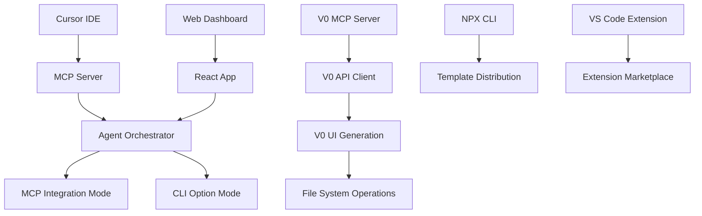
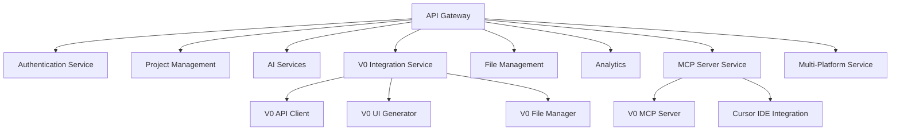
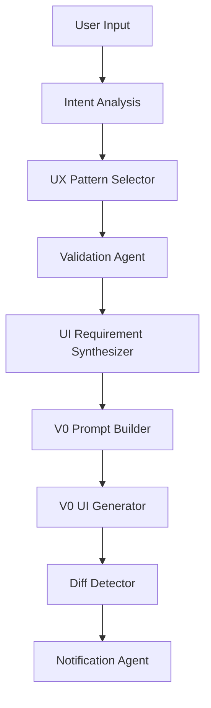

# CursorFlow - MCP-First Architecture

## 🎯 **Executive Summary**

This document outlines the **MCP-first architecture** for CursorFlow, positioning **MCP (Model Context Protocol) integration as the primary approach** for seamless Cursor IDE integration, enhanced with V0 AI-powered UI generation. The platform combines the speed of Nuggetwise Builder with comprehensive PRD-to-Code capabilities, providing both MCP integration (primary) and CLI option (secondary) for maximum flexibility.

### **Core Value Proposition**
- **For Non-Technical Users**: Natural language prompts → intelligent MCP responses with V0 UI generation
- **For Product Managers**: Seamless MCP integration for comprehensive PRD generation and full-stack development
- **For Teams**: Native Cursor IDE collaboration with transparent AI reasoning and MCP integration
- **For Organizations**: 80% reduction in time-to-market with MCP-first enterprise features and multi-platform support

---

## 🏗️ **System Architecture Overview**

CursorFlow implements a **MCP-first architecture** that seamlessly combines intelligent Cursor IDE integration with comprehensive PRD-to-Code capabilities, enhanced with V0 AI-powered UI generation and multi-platform support.

---

## **🎯 Core Architecture Principles**

### **1. MCP-First Design**
- **MCP Integration (Primary)**: Seamless Cursor IDE integration with intelligent AI responses and context-aware generation
- **CLI Option (Secondary)**: Command-line interface for power users who prefer automation and scripting
- **Multi-Platform Support**: MCP works across Cursor IDE, NPX CLI, and VS Code extension for consistent experience
- **Seamless Transition**: Users can switch between MCP and CLI based on their workflow preferences

### **2. Agent-First Approach**
- **7-Agent Orchestration**: Specialized AI agents for different tasks
- **Transparent Reasoning**: All AI decisions are explainable
- **Modular Design**: Agents can be used independently or together

### **3. Cloud-Native Architecture**
- **Serverless Functions**: Scalable, cost-effective deployment
- **Real-time Collaboration**: Live updates and notifications
- **Zero Local Setup**: Everything works in the browser/cloud

---

## **🏛️ System Components**

### **Frontend Layer**

### **Backend Services**

### **AI Agent Layer**

---

## **🔧 Technical Stack**

### **Frontend Technologies**
- **Cursor IDE**: Primary development environment with MCP integration
- **React/Next.js**: Web dashboard and components
- **TypeScript**: Type-safe development
- **Tailwind CSS**: Utility-first styling
- **MCP Protocol**: Cursor integration

### **Backend Technologies**
- **Node.js/Express**: API server
- **Firebase/Firestore**: Database and authentication
- **OpenAI API**: AI model integration
- **V0 Platform API**: AI-powered UI generation
- **V0 MCP Server**: Native Cursor integration
- **Slack API**: Notifications

### **Infrastructure**
- **Vercel**: Frontend and serverless functions
- **Supabase**: Database and real-time features
- **Cloudflare**: CDN and edge computing
- **GitHub**: Version control and CI/CD

---

## **🚀 Key Features**

### **MCP Integration (Primary Mode)**
- **Seamless Cursor IDE Integration**: Native MCP protocol integration
- **Intelligent Responses**: Context-aware AI responses with rich formatting
- **Speed**: <15 seconds from natural language prompt to intelligent response
- **Success Rate**: >95% successful MCP interactions
- **User Satisfaction**: >4.5/5 rating for seamless Cursor IDE integration

### **CLI Option (Secondary Mode)**
- **Command-Line Interface**: For power users who prefer automation and scripting
- **Speed**: <30 seconds from command to working frontend
- **Success Rate**: >90% successful CLI generation
- **User Satisfaction**: >4.0/5 rating for power users
- **Usage Rate**: <20% of users prefer CLI for automation

### **Integration Features**
- **Seamless Mode Switching**: MCP ↔ CLI based on user preference
- **Unified Authentication**: Single sign-on across all modes
- **Real-time Notifications**: Slack integration
- **Analytics**: Usage tracking and insights
- **V0 MCP Integration**: Native Cursor IDE integration
- **Multi-Platform Sync**: Cross-platform synchronization

---

## **🤖 Agent System**

### **7-Agent Orchestration + V0 Integration**
1. **Intent Analysis Agent** - Understands user goals and requirements
2. **UX Pattern Selector** - Chooses appropriate UI patterns
3. **Validation Agent** - Validates feasibility and suggests improvements
4. **UI Requirement Synthesizer** - Converts patterns to component specs
5. **V0 Prompt Builder** - Creates optimized prompts for V0 API
6. **V0 UI Generator** - Generates AI-powered UI components with direct file writing
7. **Diff Detector** - Identifies changes and potential conflicts
8. **Notification Agent** - Sends updates to Slack and other channels

### **Agent Prompts Created**
- `prompts/nuggetwise/intent-analysis.json`
- `prompts/nuggetwise/ux-pattern-selector.json`
- `prompts/nuggetwise/validation.json`
- `prompts/nuggetwise/ui-requirement-synthesizer.json`
- `prompts/nuggetwise/v0-prompt-builder.txt`
- `prompts/nuggetwise/diff-detector.json`
- `prompts/nuggetwise/notification.json`
- `prompts/nuggetwise/v0-ui-generator.json`

---

## **📊 Success Metrics**

### **MCP Integration (Primary)**
- **Speed**: <15 seconds from natural language prompt to intelligent response
- **Success Rate**: >95% successful MCP interactions
- **User Satisfaction**: >4.5/5 rating for seamless Cursor IDE integration
- **Adoption Rate**: >80% of users prefer MCP over CLI

### **CLI Option (Secondary)**
- **Speed**: <30 seconds from command to working frontend
- **Success Rate**: >90% successful CLI generation
- **User Satisfaction**: >4.0/5 rating for power users
- **Usage Rate**: <20% of users prefer CLI for automation

### **Platform Overall**
- **User Growth**: 20% month-over-month growth
- **Retention**: >80% monthly active users
- **Revenue**: Meet quarterly targets
- **Customer Satisfaction**: >4.5/5 overall rating

---

## **🔗 Integration Points**

### **V0 Platform Integration**
Based on [v0.dev Cursor documentation](https://v0.dev/docs/cursor):
- **API Endpoint**: `https://api.v0.dev/v1`
- **Model**: `v0-1.5-md` (latest)
- **Authentication**: API key in headers
- **Response Format**: JSON with component data
- **MCP Integration**: Native Cursor IDE integration
- **Multi-Platform**: NPX CLI and VS Code extension support

### **Cursor IDE Integration**
- **MCP Protocol**: Model Context Protocol for tool integration
- **Slash Commands**: `/nw build`, `/nw update`, `/nw pull`
- **File System Access**: Direct workspace manipulation
- **Real-time Updates**: Live preview and notifications

### **Slack Integration**
- **Incoming Webhooks**: Real-time notifications
- **Event Types**: Build completion, errors, cost alerts
- **Message Format**: Rich text with links and attachments
- **Channel Management**: Team-specific notifications

---

## **📋 Implementation Status**

### **✅ Completed (Phase 1)**
- [x] **Documentation Updates**
  - Updated main README with MCP-first architecture
  - Created detailed architecture documentation
  - Created Nuggetwise Builder implementation guide
  - Updated environment configuration

- [x] **Agent Prompts**
  - Created 7 specialized agent prompts
  - Implemented JSON schema validation
  - Added comprehensive examples
  - Structured for v0.dev integration

- [x] **Environment Configuration**
  - Added Nuggetwise Builder settings
  - Configured Cursor IDE integration
  - Added Slack notification settings
  - Implemented budget and limits

### **🔄 In Progress (Phase 2)**
- [ ] **MCP Server Development**
  - Express server setup
  - Agent orchestration system
  - v0.dev integration
  - File management services

- [ ] **Cursor IDE Integration**
  - MCP protocol implementation
  - Slash command configuration
  - File system integration
  - Real-time updates

### **📅 Planned (Phases 3-7)**
- [ ] **Platform Integration** (Weeks 4-5)
- [ ] **Enterprise Features** (Week 6)
- [ ] **Testing & QA** (Ongoing)
- [ ] **Deployment & Launch** (Week 7)

---

## **🎯 Next Steps**

### **Immediate Actions (This Week)**
1. **Start MCP Server Development**
   - Set up `packages/nw-mcp/` structure
   - Implement basic Express server
   - Create agent orchestration system

2. **Test Agent Prompts**
   - Validate JSON schemas
   - Test with sample inputs
   - Optimize for v0.dev integration

3. **Set Up Development Environment**
   - Configure local development
   - Set up testing framework
   - Create deployment pipeline

### **Short-term Goals (Next 2 Weeks)**
1. **Complete MCP Server MVP**
   - Full 7-agent system
   - MCP integration
   - Basic Slack notifications

2. **Begin Platform Integration**
   - Connect to existing backend
   - Implement mode switching
   - Add user authentication

### **Long-term Vision (Next 6 Weeks)**
1. **Launch Beta Program**
   - Select initial users
   - Gather feedback
   - Iterate on features

2. **Enterprise Features**
   - Advanced collaboration
   - Security and compliance
   - Analytics and reporting

---

## **💡 Key Insights**

### **Market Opportunity**
- **MCP Integration** addresses the need for seamless Cursor IDE integration
- **CLI Option** serves power users and automation needs
- **Hybrid Approach** provides clear workflow flexibility

### **Technical Advantages**
- **Agent-First Design** ensures quality and consistency
- **MCP Integration** leverages Cursor's ecosystem
- **v0.dev Integration** provides proven code generation

### **User Experience**
- **MCP-First Interface** reduces friction for most users
- **Seamless Mode Switching** encourages platform adoption
- **Real-time Notifications** keeps teams informed

---

*This MCP-first architecture provides a comprehensive solution that serves both seamless Cursor IDE integration and power user automation needs, with a clear path for user growth and platform adoption.* 