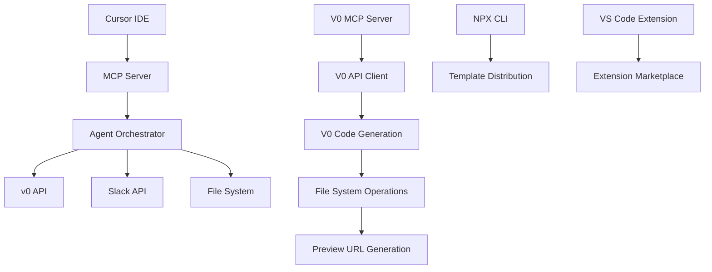

# CursorFlow Integration Guide - MCP-First Approach

## 🔗 **Integration Overview**

This guide provides comprehensive instructions for integrating CursorFlow's various components with **MCP (Model Context Protocol) as the primary approach**. The integration focuses on seamless Cursor IDE experience through MCP commands.

> **Note**: CLI option documentation is available in the `../cli-option/` folder for secondary implementation details.

---

## **🎯 Integration Architecture**

### **Component Integration Map (MCP-First Architecture)**


### **Integration Points (MCP-First Priority)**
1. **Cursor IDE ↔ MCP Server**: Primary command interface (MCP-first)
2. **MCP Server ↔ Agent Orchestrator**: AI workflow orchestration
3. **Agent Orchestrator ↔ v0 API**: Code generation
4. **Agent Orchestrator ↔ Slack**: Notifications
5. **Web Dashboard ↔ Backend**: Full platform features (commented out - MCP-first approach)
6. **V0 MCP Server ↔ V0 API**: Direct code generation
7. **V0 MCP Server ↔ File System**: Direct file operations
8. **NPX CLI ↔ Template System**: Secondary project scaffolding
9. **VS Code Extension ↔ Extension Host**: Secondary native integration

---

## **🔧 MCP Server Integration (Primary Interface)**

### **Setting Up Nuggetwise MCP Server**

#### **1. Install Dependencies**
```bash
cd packages/nw-mcp
npm install
```

#### **2. Configure Environment**
```bash
# Copy environment template
cp env.example .env

# Fill in required values
V0_API_KEY=your_v0_api_key
OPENAI_API_KEY=your_openai_api_key
SLACK_WEBHOOK_URL=your_slack_webhook
```

#### **3. Start MCP Server**
```bash
npm run dev
# Server runs on http://localhost:8787
```

### **MCP Protocol Implementation**
```typescript
// packages/nw-mcp/src/index.ts
import express from 'express';
import { AgentOrchestrator } from './services/AgentOrchestrator';
import { budgetGuard, timeoutGuard } from './middleware';

const app = express();

// Middleware
app.use(express.json());
app.use(budgetGuard);
app.use(timeoutGuard);

// MCP Tool endpoints
app.post('/tools/build', async (req, res) => {
  const { prompt, context } = req.body;
  const orchestrator = new AgentOrchestrator();
  const result = await orchestrator.orchestrateBuild(prompt, context);
  res.json(result);
});

app.post('/tools/update', async (req, res) => {
  const { prompt, projectId } = req.body;
  const orchestrator = new AgentOrchestrator();
  const result = await orchestrator.orchestrateUpdate(prompt, projectId);
  res.json(result);
});

app.post('/tools/v0-generate', async (req, res) => {
  const { prompt, targetDir, context } = req.body;
  const v0Service = new V0IntegrationService();
  const result = await v0Service.generateUI(prompt, targetDir, context);
  res.json(result);
});
```

---

## **🔧 V0 MCP Server Integration**

### **Setting Up V0 MCP Server**

#### **1. Install V0 MCP Server**
```bash
cd packages/v0-mcp-server
npm install
```

#### **2. Configure V0 Environment**
```bash
# Copy environment template
cp env.example .env

# Fill in required values
V0_API_KEY=your_v0_api_key
V0_MODEL=v0-1.5-md
V0_RATE_LIMIT=30
```

#### **3. Start V0 MCP Server**
```bash
npm run dev
# Server runs on http://localhost:8788
```

### **V0 MCP Protocol Implementation**
```typescript
// packages/v0-mcp-server/src/index.ts
import express from 'express';
import { V0IntegrationService } from './services/V0IntegrationService';
import { FileManager } from './services/FileManager';

const app = express();

// Middleware
app.use(express.json());

// V0 MCP Tool endpoints
app.post('/tools/v0.generate', async (req, res) => {
  const { prompt, targetDir, context } = req.body;
  const v0Service = new V0IntegrationService();
  const fileManager = new FileManager();
  
  try {
    const result = await v0Service.generateUI(prompt, targetDir, context);
    await fileManager.writeFiles(result.files, targetDir);
    
    res.json({
      success: true,
      files: result.files,
      previewUrl: result.previewUrl,
      performance: result.performance
    });
  } catch (error) {
    res.status(500).json({
      success: false,
      error: error.message
    });
  }
});

app.post('/tools/v0.analyze', async (req, res) => {
  const { workspace, context } = req.body;
  const v0Service = new V0IntegrationService();
  
  try {
    const analysis = await v0Service.analyzeWorkspace(workspace, context);
    res.json({
      success: true,
      analysis: analysis
    });
  } catch (error) {
    res.status(500).json({
      success: false,
      error: error.message
    });
  }
});
```

---

## **💻 Cursor IDE Integration**

### **Cursor Rules Configuration**

#### **1. Create Cursor Rules File**
```yaml
# .cursor/rules/nw.yaml
rules:
  - name: "Nuggetwise Builder Commands"
    description: "MCP-first commands for rapid prototyping within Cursor IDE"
    commands:
      - name: "/nw build"
        description: "Build a new application from description"
        handler: "mcp://localhost:8787/tools/build"
        parameters:
          - name: "prompt"
            type: "string"
            required: true
            description: "Description of the application to build"
      
      - name: "/nw update"
        description: "Update existing application with new features"
        handler: "mcp://localhost:8787/tools/update"
        parameters:
          - name: "prompt"
            type: "string"
            required: true
            description: "Description of updates to make"
          - name: "projectId"
            type: "string"
            required: false
            description: "Project ID to update"
      
      - name: "/nw pull"
        description: "Pull latest design from Figma or other sources"
        handler: "mcp://localhost:8787/tools/pull"
        parameters:
          - name: "source"
            type: "string"
            required: true
            description: "Source URL or identifier"
```

#### **2. Configure Cursor Settings**
```json
// .cursor/settings.json
{
  "mcpServers": {
    "nuggetwise": {
      "command": "node",
      "args": ["packages/nw-mcp/dist/index.js"],
      "env": {
        "NODE_ENV": "development"
      }
    }
  },
  "rules": {
    "nw": ".cursor/rules/nw.yaml"
  }
}
```

### **Command Usage Examples**
```bash
# Build a new application
/nw build "Create a task management app with dark mode and drag-and-drop functionality"

# Update existing application
/nw update "Add user authentication with Google OAuth"

# Pull design from Figma
/nw pull "https://figma.com/file/abc123/design-system"
```

---

## **🤖 Agent Orchestrator Integration**

### **Agent Configuration**
```typescript
// packages/nw-mcp/src/services/AgentOrchestrator.ts
export class AgentOrchestrator {
  private agents = {
    intent: new IntentAnalysisAgent({
      model: 'gpt-4o',
      maxTokens: 1000,
      temperature: 0.1
    }),
    ux: new UXPatternSelectorAgent({
      model: 'gpt-4o',
      maxTokens: 2000,
      temperature: 0.2
    }),
    validation: new ValidationAgent({
      model: 'gpt-4o',
      maxTokens: 1500,
      temperature: 0.1
    }),
    uiReq: new UIRequirementSynthesizerAgent({
      model: 'gpt-4o',
      maxTokens: 3000,
      temperature: 0.2
    }),
    v0Builder: new V0PromptBuilderAgent({
      model: 'gpt-4o',
      maxTokens: 4000,
      temperature: 0.3
    })
  };

  async orchestrateBuild(prompt: string, context?: BuildContext): Promise<BuildResult> {
    try {
      // Step 1: Intent Analysis
      const intent = await this.agents.intent.analyze(prompt);
      
      // Step 2: UX Pattern Selection
      const uxPatterns = await this.agents.ux.selectPatterns(intent);
      
      // Step 3: Validation
      const validation = await this.agents.validation.validate(intent, uxPatterns);
      
      // Step 4: UI Requirements
      const uiReqs = await this.agents.uiReq.synthesize(uxPatterns, validation);
      
      // Step 5: v0 Prompt Building
      const v0Prompt = await this.agents.v0Builder.buildPrompt(uiReqs);
      
      // Step 6: Generate Code
      const code = await this.generateCode(v0Prompt);
      
      return {
        success: true,
        components: code.components,
        files: code.files,
        metadata: {
          intent,
          uxPatterns,
          validation,
          uiReqs
        }
      };
    } catch (error) {
      return {
        success: false,
        error: error.message,
        metadata: {}
      };
    }
  }
}
```

---

## **🔌 External Service Integrations**

### **v0 API Integration**
```typescript
// packages/nw-mcp/src/services/V0Client.ts
export class V0Client {
  private apiKey: string;
  private baseUrl: string;

  constructor() {
    this.apiKey = process.env.V0_API_KEY!;
    this.baseUrl = process.env.V0_BASE_URL || 'https://api.v0.dev';
  }

  async generateCode(prompt: string, model: string = 'v0-1.0-md'): Promise<V0Response> {
    const response = await fetch(`${this.baseUrl}/api/generate`, {
      method: 'POST',
      headers: {
        'Authorization': `Bearer ${this.apiKey}`,
        'Content-Type': 'application/json'
      },
      body: JSON.stringify({
        prompt,
        model,
        maxTokens: 4000
      })
    });

    if (!response.ok) {
      throw new Error(`v0 API error: ${response.statusText}`);
    }

    return response.json();
  }

  async exportProject(projectId: string): Promise<ExportResult> {
    const response = await fetch(`${this.baseUrl}/api/export/${projectId}`, {
      method: 'GET',
      headers: {
        'Authorization': `Bearer ${this.apiKey}`
      }
    });

    if (!response.ok) {
      throw new Error(`Export failed: ${response.statusText}`);
    }

    return response.json();
  }
}
```

### **Slack Integration**
```typescript
// packages/nw-mcp/src/services/SlackNotifier.ts
import { IncomingWebhook } from '@slack/webhook';

export class SlackNotifier {
  private webhook: IncomingWebhook;
  private channel: string;

  constructor() {
    this.webhook = new IncomingWebhook(process.env.SLACK_WEBHOOK_URL!);
    this.channel = process.env.SLACK_CHANNEL || '#nuggetwise-builds';
  }

  async notifyBuildCompleted(buildData: BuildData): Promise<void> {
    const message = {
      channel: this.channel,
      text: '🎉 Build completed successfully!',
      blocks: [
        {
          type: 'section',
          text: {
            type: 'mrkdwn',
            text: `*Build Completed*\n• Project: ${buildData.projectName}\n• Components: ${buildData.components.length}\n• Duration: ${buildData.duration}ms`
          }
        },
        {
          type: 'actions',
          elements: [
            {
              type: 'button',
              text: {
                type: 'plain_text',
                text: 'View Project'
              },
              url: buildData.projectUrl
            }
          ]
        }
      ]
    };

    await this.webhook.send(message);
  }

  async notifyBuildFailed(error: string, buildData: BuildData): Promise<void> {
    const message = {
      channel: this.channel,
      text: '❌ Build failed',
      blocks: [
        {
          type: 'section',
          text: {
            type: 'mrkdwn',
            text: `*Build Failed*\n• Project: ${buildData.projectName}\n• Error: ${error}`
          }
        }
      ]
    };

    await this.webhook.send(message);
  }
}
```

---

## **🌐 Backend API Integration**

### **Authentication Integration**
```typescript
// backend/middleware/auth.middleware.ts
import jwt from 'jsonwebtoken';

export const authMiddleware = async (req: Request, res: Response, next: NextFunction) => {
  try {
    const token = req.headers.authorization?.replace('Bearer ', '');
    
    if (!token) {
      return res.status(401).json({ error: 'No token provided' });
    }

    const decoded = jwt.verify(token, process.env.JWT_SECRET!);
    req.user = decoded;
    next();
  } catch (error) {
    return res.status(401).json({ error: 'Invalid token' });
  }
};
```

### **Project Management Integration**
```typescript
// backend/services/project.service.ts
export class ProjectService {
  async createProject(userId: string, projectData: ProjectData): Promise<Project> {
    const project = await this.db.projects.create({
      data: {
        name: projectData.name,
        description: projectData.description,
        userId,
        status: 'active',
        createdAt: new Date()
      }
    });

    // Initialize Git repository
    await this.initializeGitRepo(project.id);

    return project;
  }

  async updateProject(projectId: string, updates: ProjectUpdates): Promise<Project> {
    const project = await this.db.projects.update({
      where: { id: projectId },
      data: updates
    });

    // Create version snapshot
    await this.createVersionSnapshot(projectId, updates);

    return project;
  }
}
```

---

## **📊 Analytics Integration**

### **Event Tracking**
```typescript
// backend/services/analytics.service.ts
export class AnalyticsService {
  async trackEvent(userId: string, event: string, metadata: any): Promise<void> {
    await this.db.analytics.create({
      data: {
        userId,
        event,
        metadata: JSON.stringify(metadata),
        timestamp: new Date()
      }
    });

    // Send to external analytics if configured
    if (process.env.ANALYTICS_KEY) {
      await this.sendToExternalAnalytics(event, metadata);
    }
  }

  async trackBuildMetrics(buildData: BuildMetrics): Promise<void> {
    await this.trackEvent(buildData.userId, 'build_completed', {
      duration: buildData.duration,
      components: buildData.components.length,
      cost: buildData.cost,
      success: buildData.success
    });
  }
}
```

---

## **🔧 Configuration Management**

### **Environment Configuration**
```typescript
// shared/config/environment.ts
export const config = {
  // AI Services
  openai: {
    apiKey: process.env.OPENAI_API_KEY,
    model: process.env.OPENAI_MODEL || 'gpt-4o',
    maxTokens: parseInt(process.env.MAX_TOKENS || '4000')
  },

  // v0 Integration
  v0: {
    apiKey: process.env.V0_API_KEY,
    baseUrl: process.env.V0_BASE_URL || 'https://api.v0.dev',
    model: process.env.V0_MODEL || 'v0-1.0-md'
  },

  // Slack Integration
  slack: {
    webhookUrl: process.env.SLACK_WEBHOOK_URL,
    channel: process.env.SLACK_CHANNEL || '#nuggetwise-builds'
  },

  // Budget & Limits
  limits: {
    weeklyBudget: parseFloat(process.env.BUDGET_WEEKLY_USD || '50'),
    monthlyBudget: parseFloat(process.env.BUDGET_MONTHLY_USD || '200'),
    maxBuildTime: parseInt(process.env.MAX_BUILD_TIME || '30000'),
    maxTokensPerBuild: parseInt(process.env.MAX_TOKENS_PER_BUILD || '10000')
  }
};
```

### **Feature Flags**
```typescript
// shared/config/features.ts
export const features = {
  quickBuild: process.env.ENABLE_QUICK_BUILD === 'true',
  fullPlatform: process.env.ENABLE_FULL_PLATFORM === 'true',
  analytics: process.env.ENABLE_ANALYTICS === 'true',
  notifications: process.env.ENABLE_NOTIFICATIONS === 'true',
  caching: process.env.ENABLE_CACHING === 'true'
};
```

---

## **🧪 Testing Integration**

### **Integration Tests**
```typescript
// packages/nw-mcp/tests/integration.test.ts
describe('MCP Server Integration', () => {
  test('should handle build request', async () => {
    const response = await request(app)
      .post('/tools/build')
      .send({
        prompt: 'Create a simple todo app',
        context: { framework: 'react', styling: 'tailwind' }
      });

    expect(response.status).toBe(200);
    expect(response.body.success).toBe(true);
    expect(response.body.components).toBeDefined();
  });

  test('should handle budget limits', async () => {
    // Mock budget exceeded
    jest.spyOn(budgetGuard, 'checkBudget').mockResolvedValue(false);

    const response = await request(app)
      .post('/tools/build')
      .send({ prompt: 'Create a complex app' });

    expect(response.status).toBe(429);
    expect(response.body.error).toContain('Budget exceeded');
  });
});
```

---

## **🚀 Deployment Integration**

### **Docker Configuration**
```dockerfile
# packages/nw-mcp/Dockerfile
FROM node:18-alpine

WORKDIR /app

COPY package*.json ./
RUN npm ci --only=production

COPY dist ./dist
COPY .env ./

EXPOSE 8787

CMD ["node", "dist/index.js"]
```

### **Kubernetes Deployment**
```yaml
# k8s/mcp-server.yaml
apiVersion: apps/v1
kind: Deployment
metadata:
  name: nuggetwise-mcp
spec:
  replicas: 3
  selector:
    matchLabels:
      app: nuggetwise-mcp
  template:
    metadata:
      labels:
        app: nuggetwise-mcp
    spec:
      containers:
      - name: mcp-server
        image: cursorflow/nuggetwise-mcp:latest
        ports:
        - containerPort: 8787
        env:
        - name: V0_API_KEY
          valueFrom:
            secretKeyRef:
              name: api-keys
              key: v0-api-key
        - name: OPENAI_API_KEY
          valueFrom:
            secretKeyRef:
              name: api-keys
              key: openai-api-key
```

---

## **📋 Integration Checklist**

### **Pre-Integration Setup**
- [ ] Install all dependencies
- [ ] Configure environment variables
- [ ] Set up external service accounts
- [ ] Configure Cursor IDE rules
- [ ] Test individual components

### **Integration Testing**
- [ ] Test MCP server connectivity
- [ ] Verify agent orchestration
- [ ] Test v0 API integration
- [ ] Validate Slack notifications
- [ ] Test file system operations

### **Production Deployment**
- [ ] Deploy MCP server
- [ ] Configure production environment
- [ ] Set up monitoring and alerting
- [ ] Test end-to-end workflows
- [ ] Validate security measures

---

> **CLI Option Documentation**: For CLI-specific integration details, see [`../cli-option/CLI_INTEGRATION.md`](../cli-option/CLI_INTEGRATION.md).

---

*This integration guide provides comprehensive instructions for connecting all CursorFlow components into a cohesive platform with MCP as the primary and only approach. CLI and extension options are available as optional future enhancements.* 